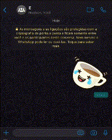

<html>
    <p align="center">
        
    </p>
    <h1 align="center">Telegram to WhatsApp</h1>
    <p align="center">Projeto que utiliza o <b>venom</b> e a API de Bots do Telegram
        <br>para fazer a cópia em tempo real das mensagens do WhatsApp para o Telegram
    </p>
    <p align="center">
        
        
        
    </p>
    <h2></h2>
    <h2>Exemplo de uso</h2>
    <p>Eu criei esse projeto para receber algumas mensagens no grupo da minha sala e encaminhar para um canal no telegram.</p>
    <span>O GIF abaixo mostra esse processo acontecendo na tela do meu Celular.<br>
    Enquanto a mensagem é enviada em um determinado grupo o bot <b>baixa, descriptografa e envia para o Telegram.<b> 
    </span>
    <p align="center"><br>
        
    </p>
    <br>
    <h2></h2>
    <h2>Instalação</h2>
    <p>Para realizar a instalação faça os seguintes comandos:</p>
    
</html>

```
git clone https://github.com/NiedsonEmanoel/telegramToWhatsApp
```
```
cd telegramToWhatsApp
```
```
npm install
```
```
cp .env-example .env

Configure seu .env com seu ID, TOKEN e GROUP_ID (ver documentação do VENOM). 
```
```
npm start
```
## 
## Contribua

1. Faça o _fork_ do projeto (<https://github.com/NiedsonEmanoel/telegramToWhatsApp/fork>)
2. Crie uma _branch_ para sua modificação (`git checkout -b feature/fooBar`)
3. Faça o _commit_ (`git commit -am 'Add some fooBar'`)
4. _Push_ (`git push origin feature/fooBar`)
5. Crie um novo _Pull Request_

<html>
<h2></h2>
<h2 align= "center">Sobre o autor [META]</h2>
<p align='center'>
<b>Niedson Emanoel<b><br>
  A Mobile & BackEnd Developer from Petrolina, Brazil.
</p>

<p align='center'>
  <a href="https://www.linkedin.com/in/niedsonemanoel/">
    
  </a>
  <a href="https://instagram.com/niedsonemanoel">
            
  </a>
</p>
<p align='center'>
  <a href="#"></a>
</p>
</html>